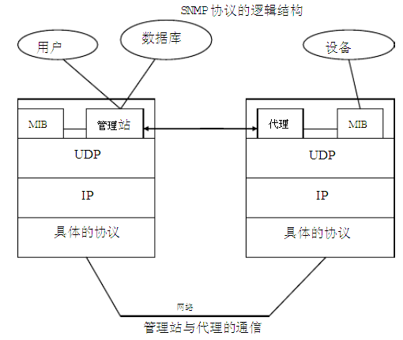
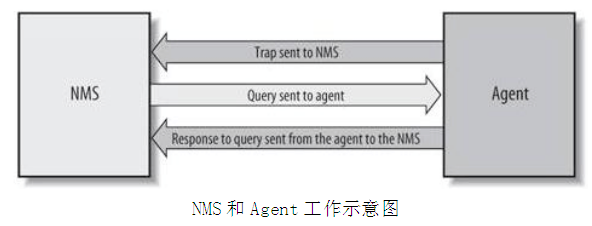

#        

孤傲苍狼 只为成功找方法，不为失败找借口！

[Snmp学习总结(一)——Snmp的基本概念](https://www.cnblogs.com/xdp-gacl/p/3978825.html)

## SNMP 简单概述

### 什么是Snmp

SNMP是英文"Simple Network Management Protocol"的缩写，中文意思是"简单网络管理协议"
。SNMP是一种简单网络管理协议，它属于TCP/IP五层协议中的应用层协议，用于网络管理的协议。SNMP主要用于网络设备的管理。由于SNMP协议简单可靠
，受到了众多厂商的欢迎，成为了目前最为广泛的网管协议。

SNMP协议主要由两大部分构成：SNMP管理站和SNMP代理。SNMP管理站是一个中心节点，负责收集维护各个SNMP元素的信息，并对这些信息进行处理，最后反馈给网络管理员；而SNMP代理是运行在各个被管理的网络节点之上，负责统计该节点的各项信息，并且负责与SNMP管理站交互，接收并执行管理站的命令，上传各种本地的网络信息。

SNMP管理站和SNMP代理之间是松散耦合。他们之间的通信是通过UDP协议完成的。一般情况下，SNMP管理站通过UDP协议向SNMP代理发送各种命令，当SNMP代理收到命令后，返回SNMP管理站需要的参数。但是当SNMP代理检测到网络元素异常的时候，也可以主动向SNMP管理站发送消息，通告当前异常状况。

SNMP的基本思想：为不同种类的设备、不同厂家生产的设备、不同型号的设备，定义为一个统一的接口和协议，使得管理员可以是使用统一的外观面对这些需要管理的网络设备进行管理。通过网络，管理员可以管理位于不同物理空间的设备，从而大大提高网络管理的效率，简化网络管理员的工作。

SNMP的工作方式：管理员需要向设备获取数据，所以SNMP提供了【读】操作；管理员需要向设备执行设置操作，所以SNMP提供了【写】操作；设备需要在重要状况改变的时候，向管理员通报事件的发生，所以SNMP提供了【Trap】操作。

#### SNMP 和 UDP

SNMP采用UDP协议在管理端和agent之间传输信息。 SNMP采用UDP
161端口接收和发送请求，162端口接收trap，执行SNMP的设备缺省都必须采用这些端口。SNMP消息全部通过UDP端口161接收，只有Trap信息采用UDP端口162。

### Snmp版本

SNMP目前共有v1，v2，v3这三个版本：

- SNMP v1是SNMP协议的最初版本，不过依然是众多厂家实现SNMP基本方式。
- SNMP v2通常被指是基于community的SNMP V2。Community实质上就是密码。
- SNMP v3 是最新版本的SNMP。它对网络管理最大的贡献在于其安全性。增加了对认证和密文传输的支持。

### Snmp的实现结构

在具体实现上，SNMP为管理员提供了一个网管平台(NMS)
，又称为【管理站】，负责网管命令的发出、数据存储、及数据分析。【被】监管的设备上运行一个SNMP代理(Agent))，代理实现设备与管理站的SNMP通信。

管理站与代理端通过MIB进行接口统一，MIB定义了设备中的被管理对象。管理站和代理都实现了相应的MIB对象，使得双方可以识别对方的数据，实现通信。管理站向代理申请MIB中定义的数据，代理识别后，将管理设备提供的相关状态或参数等数据转换为MIB定义的格式，应答给管理站，完成一次管理操作。

### Snmp有关的基本概念

#### 代理和管理站的模型

Snmp分2种角色：SNMP管理站（manager，我们的本机127.0.0.1）和SNMP代理（agent， 我们要操作的机器，比如
192.168.1.144）。管理站指的是运行了可以执行网络管理任务软件的服务器，通常被称作为网络管理工作站（NMS）,NMS负责采样网络中agent的信息，并接受agent的trap。代理是实际网络设备中用来实现SNMP功能的部分。代理在UDP的161端口接收NMS的读写请求消息，管理站在UDP的162端口接收代理的事件通告消息。所以，一旦获取设备的访问权限（community，默认为public），就可以访问设备信息、改写和配置设备参数。由于采用UDP协议，不需要在代理和管理站之间保持连接。

#### SNMP的操作命令

SNMP协议之所以易于使用，这是因为它对外提供了三种用于控制MIB对象的基本操作命令。它们是：Get、Set 和 Trap。

1. Get：管理站读取代理者处对象的值。它是SNMP协议中使用率最高的一个命令，因为该命令是从网络设备中获得管理信息的基本方式。
2. Set：管理站设置代理者处对象的值。它是一个特权命令，因为可以通过它来改动设备的配置或控制设备的运转状态。它可以设置设备的名称，关掉一个端口或清除一个地址解析表中的项等。
3. Trap： 代理者主动向管理站通报重要事件。它的功能就是在网络管理系统没有明确要求的前提下，由管理代理通知网络管理系统有一些特别的情况或问题
   发生了。如果发生意外情况，客户会向服务器的162端口发送一个消息，告知服务器指定的变量值发生了变化。通常由服务器请求而获得的数据由服务器的161
   端口接收。Trap 消息可以用来通知管理站线路的故障、连接的终端和恢复、认证失败等消息。管理站可相应的作出处理。

#### SNMP的消息构成

SNMP协议定义了数据包的格式，及网络管理员和管理代理之间的信息交换，它还控制着管理代理的MIB数据对象。因此，可用于处理管理代理定义的各种任务。
一条SNMP消息由"版本号"、"SNMP共同体名"和"协议数据单元(PDU)"构成，数据包的长度不是固定的。

- 版本识别符(version identifier)：用于说明现在使用的是哪个版本的SNMP协议，确保SNMP代理使用相同的协议，每个SNMP代理都直接抛弃与自己协议版本不同的数据报。
- 团体名(Community Name)：团体（community）是基本的安全机制，用于实现SNMP网络管理员访问SNMP管理代理时的身份验证。类似于密码，默认值为
  public。团体名（Community
  name）是管理代理的口令，管理员被允许访问数据对象的前提就是网络管理员知道网络代理的口令。如果把配置管理代理成可以执行Trap命令，当网络管理员用一个错误的分区名查询管理代理时，系统就发送一个autenticationFailure
  trap报文。
- 协议数据单元（PDU）：PDU (协议数据单元)是SNMP消息中的数据区， 即Snmp通信时报文数据的载体。PDU指明了SNMP的消息类型及其相关参数

#### PDU(协议数据单元)

PDU (协议数据单元)是SNMP消息中的数据区， 即Snmp通信时报文数据的载体。

#### MIB(管理信息库)

管理信息(MIB)
库可以理解成为agent维护的管理对象数据库，MIB中定义的大部分管理对象的状态和统计信息都可以被NMS访问。MIB是一个按照层次结构组织的树状结构，每个被管对象对应树形结构的一个叶子节点，称为一个object，拥有唯一的数字标识符

MIB数据对象以一种树状分层结构进行组织，这个树状结构中的每个分枝都有一个专用的名字和一个数字形式的标识符。结构树的分枝实际表示的是数据对象的逻
辑分组。而树叶，有时候也叫节点（node），代表了各个数据对象。在结构树中使用子树表示增加的中间分枝和增加的树叶。
使用这个树状分层结构，MIB浏览器能够以一种方便而且简洁的方式访问整个MIB数据库。MIB浏览器是这样一种工具，它可以遍历整棵MIB结构树，通常
以图形显示的形式来表示各个分枝和树叶对象。可以通过其数字标识符来查找MIB中的数据对象，这个数字标识符号从结构树的顶部（或根部）开始，直到各个叶
子节点（即数据对象）为止。这种访问方式和文件系统的组织方式一致。两者的主要区别在于文件系统中的路径名可以以绝对也可以以相对方式表示，而MIB数据
对象只能以绝对方式表示，不能使用相对方式。
每一个节点都有一个对象标识符（OID）来唯一的标识，每个节点用数字和字符两种方式显示，其中对象标识符OID是由句点隔开的一组整数，也就是从根节点
通向它的路径。一个带标号节点可以拥有包含其它带标号节点为它的子树，如果没有子树它就是叶子节点，它包含一个值并被称为对象。比如网络设备名的oid
是.1.3.6.1.2.1.1.5.0，其值为设备名称的字符串。
网络资源被抽象为对象进行管理。但SNMP中的对象是表示被管资源某一方面的数据变量。对象被标准化为跨系统的类，对象的集合被组织为管理信息库
（MIB）。MIB作为设在代理者处的管理站访问点的集合，管理站通过读取MIB中对象的值来进行网络监控。管理站可以在代理者处产生动作，也可以通过修改变量值改变代理者处的配置。

#### OID(Object Identifier)

每个管理对象都有自己的OID(Object Identifier)，管理对象通过树状结构进行组织，OID由树上的一系列整数组成，整数之间用点( . )
分隔开，树的叶子节点才是真正能够被管理的对象。

## SNMP 教程

[原始连接](https://www.manageengine.com/tw/network-monitoring/what-is-snmp.html)

本教程是为了简要解说

* 什么是 SNMP？
* SNMP 的基本元件及其功能
* SNMP 基本命令
* 典型 SNMP 通讯是如何发生的？
* SNMP 版本（SNMP v1、v2 和 v3）

## 什么是 SNMP？

简易网路管理通讯协定 (SNMP) ，是由网际网路架构委员会 (IAB) 在 RFC1157
中定义的应用程式层通讯协定，用于交换网路装置之间的管理资讯。它是传输控制通讯协定 / 网际网路通讯协定 (TCP⁄IP) 通讯协定组合的一部分。

SNMP 是用于管理和监视网路元素的广泛接受的通讯协定之一。大多数专业级网路元素都具有配套的 SNMP
代理程式。必须启用并设定这些代理程式，以与网路管理系统 (NMS) 进行通讯。

## SNMP 基本元件及其功能

SNMP 包括

* SNMP 管理器
* 受控装置
* SNMP 代理程式
* 管理资讯资料库，也称为管理资讯库 (MIB)

### SNMP 管理器

管理器或管理系统是一个独立的实体，负责与有实施 SNMP 代理程式的网路装置进行通讯。这通常是用于执行一个或多个网路管理系统的电脑。

SNMP 管理器的主要功能

* 查询代理程式
* 从代理程式获得回应
* 在代理程式中设定变数
* 确认来自代理程式的异步事件

### 受控装置

受控装置或网路元素，是需要某种形式的监视和管理的网路的一部分，如路由器、交换器、伺服器、工作站、印表机、UPS 等等。

### SNMP 代理程式

代理程序是封包在网路元素中的程式。启用代理程式，可让其从本地收集装置的管理资讯资料库，并使其在 SNMP 管理器查询时可用。这些代理程式可以是标准的（如
Net-SNMP），也可特定于供应商（如 HP Insight Agent）

SNMP 代理程式的主要功能

* 收集有关其本地环境的管理资讯
* 存储和撷取 MIB 中定义的管理资讯。
* 向管理器传送事件。
* 充当一些非 SNMP 可管理网路节点的 proxy。

基本 SNMP 通讯图表

SNMP 的基本元件及其功能- ManageEngine OpManager SNMP

### 管理资讯资料库或管理资讯库 (MIB)

每个 SNMP 代理程式都有一个描述受控装置参数资讯资料库。SNMP 管理器使用此资料库，向代理程式请求特定资讯，并根据网路管理系统 (
NMS) 的需求，进一步翻译资讯。代理程式和管理器之间共用的资料库称为管理资讯库 (MIB)。

通常，这些 MIB 包含为网路上的硬体节点定义的标准统计和控制值集合。SNMP 还允许透过使用私人 MIB ，将特定于特定代理程式的值，扩展到这些标准值。

简而言之，MIB 档案是 SNMP 管理器可以询问代理程式的问题集合。如 MIB 中所定义，代理程式在本地收集这些资料并将其存储。因此，SNMP
管理器应该了解每种类型代理程式的这些标准和私人问题。

#### SNMP MIB Browser and SNMP Walk Tool

ManageEngine's Suite of Free Tools includes a SNMP MIB Browser which helps to Load/unload MIBs and fetch MIB data of
SNMP(v1, v2c, v3) agents. SNMP MIB Browser is a complete tool for monitoring SNMP enabled devices and servers. You can
load, view multiple MIB modules and perform GET, GETNEXT and SET SNMP operations. This tool is easy to use and allows
you to view, configure and parse SNMP traps. You can also perform SNMP operations from Windows and Linux devices.

#### MIB 结构和物件识别码（物件 ID 或 OID）

管理资讯库 (MIB) 是用于管理网路元素的资讯的集合。MIB 包含由名称物件识别码（物件 ID 或 OID）标识的受控物件。

每个识别码都是唯一的，并表示受控装置的特定特性。当查询时，每个识别码的返回值可能不同，如文字、数字、计数等...

有两种类型的受控物件或物件 ID：纯量和表格式。透过一个例子来更好的理解它们

纯量：装置的厂商名称，结果只能有一个。（如定义所述：「纯量物件定义单个物件执行个体」）

表格式：四元组处理器的 CPU 使用率，这将分别为每个 CPU 给出结果，这意味着该特定物件 ID 将有 4 个结果。（如定义所述：「表格式物件定义了在
MIB 表格中分组在一起的多个相关物件执行个体」）

每个物件 ID 都是在 MIB 中按阶层组织的。MIB 阶层可以用具有单个变数识别码的树状结构表示。

一个典型物件 ID 将是一个整数的点线清单。例如，RFC1213 中「sysDescr」的 OID 为.1.3.6.1.2.1.1.1

MIB 树表

SNMP MIB 树表- ManageEngine OpManager SNMP

## SNMP 的基本命令

资讯交换的简单性使得 SNMP 成为广泛接受的通讯协定。主要原因是简洁的命令集，以下为命令集清单：

* **GET**：GET 操作是管理器向受控装置传送的请求。执行该操作可从受控装置撷取一个或多个值。
* **GET NEXT**：此操作与 GET 相似。重要的区别是 GET NEXT 操作撷取 MIB 树中下一个 OID 的值。
* **GET BULK**：GETBULK 操作用于从大型 MIB 表格中撷取大量资料。
* **SET**：管理员使用此操作修改或分配受控装置的值。
* **TRAPS**：与从 SNMP 管理器启动的上述命令不同，TRAPS 由代理程式启动。这是代理程式在发生事件时向 SNMP 管理器发出的讯号。
* **INFORM**：该命令与代理程式启动的 TRAP 类似，但 INFORM 包含 SNMP 管理器在接收讯息时的确认。
* **RESPONSE**：此命令用于传回由 SNMP 管理器执行的动作的值或讯号。

## 典型 SNMP 通讯

作为 TCP⁄ IP 通讯协定组合的一部分，SNMP 讯息被包装为使用者资料包通讯协定 (UDP)
，并在网际网路通讯协定中包装并传输。下图将说明防御部门 (DoD) 开发的四层模型。

典型SNMP 通讯- ManageEngine OpManager SNMP、

### GET⁄ GET NEXT⁄ GET BULK⁄ SET

How SNMP Monitoring works in Networking? - ManageEngine OpManager SNMP

TRAP

SNMP Traps Tutorial - ManageEngine OpManager SNMP

INFORM

SNMP Tutorial for beginners - ManageEngine OpManager SNMP

预设情况下，SNMP 使用连接埠 161、TRAP / INFORM 使用连接埠 162 进行通讯。

## SNMP 版本

SNMP 自启动以来，已经经历了重大的升级。但是，SNMP v1 和 v2c 是 SNMP 实施最多的版本。对 SNMP v3
的支援最近开始迎头赶上，因为与旧版本相比，它更安全，但仍未达到可观的市场占有率。

### SNMPv1

这是通讯协定的第一个版本，在 RFC 1155 和 1157 中定义

### SNMPv2c

这是已修订的协议，它包括 SNMPv1 在通讯协定封包类型、传输对应、MIB 结构元素方面的增强功能，但仍使用现有 SNMPv1
的管理结构（「基于社群」，因此称为 SNMPv2c）。它在 RFC 1901、RFC 1905、RFC 1906 和 RFC 2578 中定义。

### SNMPv3

SNMPv3 定义了 SNMP 的安全版本。SNMPv3 还有助于 SNMP 实体的远端设定。它由 RFC 1905、RFC 1906、RFC 3411、RFC 3412、RFC 3414 和
RFC 3415 定义。

尽管每个版本都经过完善具有更丰富的功能，但是每次升级时都会强调安全性。这是每个版本安全性方面的一个小剪辑。

| 版本       | 支持        |
|----------|-----------|
| SNMP v1  | 基于社群的安全性  |
| SNMP v2c | 基于社群的安全性  |
| SNMP v2u | 基于使用者的安全性 |
| SNMP v2  | 基于当事方的安全性 |
| SNMP v3  | 基于使用者的安全性 |
