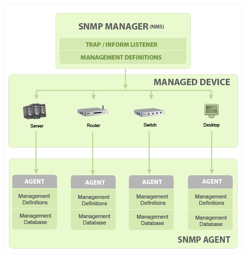
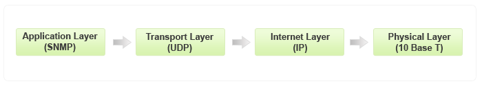
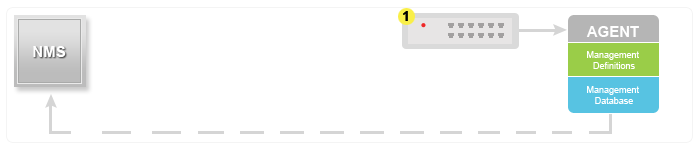
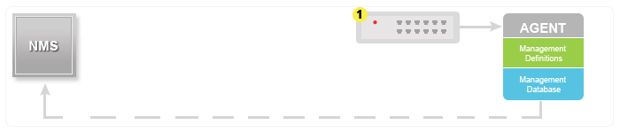

# SNMP 教程

[原始连接](https://www.manageengine.com/tw/network-monitoring/what-is-snmp.html)

本教程是为了简要解说

* 什么是 SNMP？
* SNMP 的基本元件及其功能
* SNMP 基本命令
* 典型 SNMP 通讯是如何发生的？
* SNMP 版本（SNMP v1、v2 和 v3）

## 什么是 SNMP？

简易网路管理通讯协定 (SNMP) ，是由网际网路架构委员会 (IAB) 在 RFC1157 中定义的应用程式层通讯协定，用于交换网路装置之间的管理资讯。它是传输控制通讯协定 / 网际网路通讯协定 (TCP⁄IP) 通讯协定组合的一部分。

SNMP 是用于管理和监视网路元素的广泛接受的通讯协定之一。大多数专业级网路元素都具有配套的 SNMP 代理程式。必须启用并设定这些代理程式，以与网路管理系统 (NMS) 进行通讯。

## SNMP 基本元件及其功能

SNMP 包括

* SNMP 管理器
* 受控装置
* SNMP 代理程式
* 管理资讯资料库，也称为管理资讯库 (MIB)

### SNMP 管理器

管理器或管理系统是一个独立的实体，负责与有实施 SNMP 代理程式的网路装置进行通讯。这通常是用于执行一个或多个网路管理系统的电脑。

SNMP 管理器的主要功能

* 查询代理程式
* 从代理程式获得回应
* 在代理程式中设定变数
* 确认来自代理程式的异步事件

### 受控装置

受控装置或网路元素，是需要某种形式的监视和管理的网路的一部分，如路由器、交换器、伺服器、工作站、印表机、UPS 等等。

### SNMP 代理程式

代理程序是封包在网路元素中的程式。启用代理程式，可让其从本地收集装置的管理资讯资料库，并使其在 SNMP 管理器查询时可用。这些代理程式可以是标准的（如 Net-SNMP），也可特定于供应商（如 HP Insight Agent）

SNMP 代理程式的主要功能

* 收集有关其本地环境的管理资讯
* 存储和撷取 MIB 中定义的管理资讯。
* 向管理器传送事件。
* 充当一些非 SNMP 可管理网路节点的 proxy。

基本 SNMP 通讯图表

SNMP 的基本元件及其功能- ManageEngine OpManager SNMP

### 管理资讯资料库或管理资讯库 (MIB)

每个 SNMP 代理程式都有一个描述受控装置参数资讯资料库。SNMP 管理器使用此资料库，向代理程式请求特定资讯，并根据网路管理系统 (NMS) 的需求，进一步翻译资讯。代理程式和管理器之间共用的资料库称为管理资讯库 (MIB)。

通常，这些 MIB 包含为网路上的硬体节点定义的标准统计和控制值集合。SNMP 还允许透过使用私人 MIB ，将特定于特定代理程式的值，扩展到这些标准值。

简而言之，MIB 档案是 SNMP 管理器可以询问代理程式的问题集合。如 MIB 中所定义，代理程式在本地收集这些资料并将其存储。因此，SNMP 管理器应该了解每种类型代理程式的这些标准和私人问题。

#### SNMP MIB Browser and SNMP Walk Tool

ManageEngine's Suite of Free Tools includes a SNMP MIB Browser which helps to Load/unload MIBs and fetch MIB data of SNMP(v1, v2c, v3) agents. SNMP MIB Browser is a complete tool for monitoring SNMP enabled devices and servers. You can load, view multiple MIB modules and perform GET, GETNEXT and SET SNMP operations. This tool is easy to use and allows you to view, configure and parse SNMP traps. You can also perform SNMP operations from Windows and Linux devices.

#### MIB 结构和物件识别码（物件 ID 或 OID）

管理资讯库 (MIB) 是用于管理网路元素的资讯的集合。MIB 包含由名称物件识别码（物件 ID 或 OID）标识的受控物件。

每个识别码都是唯一的，并表示受控装置的特定特性。当查询时，每个识别码的返回值可能不同，如文字、数字、计数等...

有两种类型的受控物件或物件 ID：纯量和表格式。透过一个例子来更好的理解它们

纯量：装置的厂商名称，结果只能有一个。（如定义所述：「纯量物件定义单个物件执行个体」）

表格式：四元组处理器的 CPU 使用率，这将分别为每个 CPU 给出结果，这意味着该特定物件 ID 将有 4 个结果。（如定义所述：「表格式物件定义了在 MIB 表格中分组在一起的多个相关物件执行个体」）

每个物件 ID 都是在 MIB 中按阶层组织的。MIB 阶层可以用具有单个变数识别码的树状结构表示。

一个典型物件 ID 将是一个整数的点线清单。例如，RFC1213 中「sysDescr」的 OID 为.1.3.6.1.2.1.1.1

MIB 树表

SNMP MIB 树表- ManageEngine OpManager SNMP

## SNMP 的基本命令

资讯交换的简单性使得 SNMP 成为广泛接受的通讯协定。主要原因是简洁的命令集，以下为命令集清单：

* **GET**：GET 操作是管理器向受控装置传送的请求。执行该操作可从受控装置撷取一个或多个值。
* **GET NEXT**：此操作与 GET 相似。重要的区别是 GET NEXT 操作撷取 MIB 树中下一个 OID 的值。
* **GET BULK**：GETBULK 操作用于从大型 MIB 表格中撷取大量资料。
* **SET**：管理员使用此操作修改或分配受控装置的值。
* **TRAPS**：与从 SNMP 管理器启动的上述命令不同，TRAPS 由代理程式启动。这是代理程式在发生事件时向 SNMP 管理器发出的讯号。
* **INFORM**：该命令与代理程式启动的 TRAP 类似，但 INFORM 包含 SNMP 管理器在接收讯息时的确认。
* **RESPONSE**：此命令用于传回由 SNMP 管理器执行的动作的值或讯号。

## 典型 SNMP 通讯

作为 TCP⁄ IP 通讯协定组合的一部分，SNMP 讯息被包装为使用者资料包通讯协定 (UDP)，并在网际网路通讯协定中包装并传输。下图将说明防御部门 (DoD) 开发的四层模型。

典型SNMP 通讯- ManageEngine OpManager SNMP、

### GET⁄ GET NEXT⁄ GET BULK⁄ SET

How SNMP Monitoring works in Networking? - ManageEngine OpManager SNMP

TRAP

SNMP Traps Tutorial - ManageEngine OpManager SNMP

INFORM

SNMP Tutorial for beginners - ManageEngine OpManager SNMP

预设情况下，SNMP 使用连接埠 161、TRAP / INFORM 使用连接埠 162 进行通讯。

## SNMP 版本

SNMP 自启动以来，已经经历了重大的升级。但是，SNMP v1 和 v2c 是 SNMP 实施最多的版本。对 SNMP v3 的支援最近开始迎头赶上，因为与旧版本相比，它更安全，但仍未达到可观的市场占有率。

### SNMPv1

这是通讯协定的第一个版本，在 RFC 1155 和 1157 中定义

### SNMPv2c

这是已修订的协议，它包括 SNMPv1 在通讯协定封包类型、传输对应、MIB 结构元素方面的增强功能，但仍使用现有 SNMPv1 的管理结构（「基于社群」，因此称为 SNMPv2c）。它在 RFC 1901、RFC 1905、RFC 1906 和 RFC 2578 中定义。

### SNMPv3

SNMPv3 定义了 SNMP 的安全版本。SNMPv3 还有助于 SNMP 实体的远端设定。它由 RFC 1905、RFC 1906、RFC 3411、RFC 3412、RFC 3414 和 RFC 3415 定义。

尽管每个版本都经过完善具有更丰富的功能，但是每次升级时都会强调安全性。这是每个版本安全性方面的一个小剪辑。

版本     | 支持
---------|----------
SNMP v1  | 基于社群的安全性
SNMP v2c | 基于社群的安全性
SNMP v2u | 基于使用者的安全性
SNMP v2  | 基于当事方的安全性
SNMP v3  | 基于使用者的安全性
